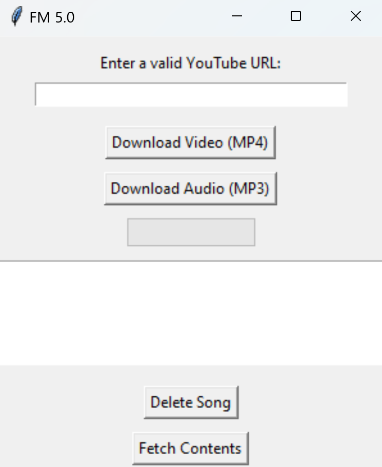

<!DOCTYPE html>
<html>

<body>

  <h1>FM 5.0 - YouTube Downloader</h1>

  <h2>Overview</h2>

  

  
FM 5.0 is a simple YouTube downloader that allows you to download both video and audio content from YouTube. It uses the <code>yt_dlp</code> library for YouTube downloads and <code>ffmpeg</code> for audio extraction.

Download the FM 5.0 YouTube Downloader executable for a hassle-free experience. This standalone executable is packaged with all the necessary dependencies, allowing you to use the application without worrying about installing Python, yt_dlp, or ffmpeg separately. Simply download the executable, run it on your Windows machine, and start downloading your favorite YouTube content with ease.

Click <a href="https://github.com/JRH89/FM5/releases/download/v5/main.exe">HERE</a> to download.

  <h2>Prerequisites</h2>

  <ul>
    <li><a href="https://www.python.org/downloads/">Python</a> (version 3.6 or later)</li>
    <li><a href="https://github.com/yt-dlp/yt-dlp">yt_dlp</a> library (<code>pip install yt-dlp</code>)</li>
    <li><a href="https://ffmpeg.org/download.html">ffmpeg</a> (make sure it's in your system's PATH)</li>
  </ul>

  <h2>Installation</h2>

  <ol>
    <li><strong>Clone the repository:</strong></li>
    <pre>git clone https://github.com/yourusername/FM-5.0.git
cd FM-5.0</pre>
    <li><strong>Install dependencies:</strong></li>
    <pre>pip install -r requirements.txt</pre>
    <li><strong>Run the script:</strong></li>
    <pre>python main.py</pre>
  </ol>

  <h2>Usage</h2>

  <ol>
    <li>Enter a valid YouTube URL in the provided input field.</li>
    <li>Choose whether to download the video in MP4 or audio in MP3.</li>
    <li>Click the corresponding "Download" button.</li>
  </ol>

  <h2>Additional Information</h2>

  <ul>
    <li>The downloaded files will be saved in the <code>FM5</code> directory.</li>
    <li>To fetch the contents of the <code>FM5</code> directory, click the "Fetch Contents" button.</li>
    <li>To delete a downloaded song, select it from the list and click the "Delete Song" button.</li>
  </ul>

  <h2>Troubleshooting</h2>

  <ul>
    <li>If you encounter issues, make sure you have the required dependencies installed.</li>
    <li>For MP3 downloads, ensure that <code>ffmpeg</code> is correctly installed and in your system's PATH.</li>
  </ul>

</body>

</html>
